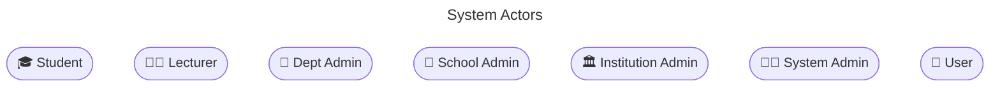
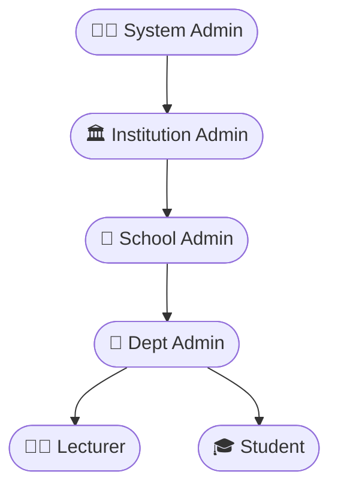

# 👥 System Actors & Access Matrix

> Who's in the system, what they represent, and exactly what they can touch.

---

## 🎭 Actors

---

## 🔑 Role Hierarchy

> Each level inherits **less** access than the one above it.
> Institution Admin sees everything. Student sees nothing in admin.

---

## 📊 Role Access Matrix

| Model           | 🏛️ Institution Admin | 🏫 School Admin | 🏢 Dept Admin | 👨‍🏫 Lecturer  |
| --------------- | -------------------- | --------------- | ------------- | ------------ |
| 🎓 Student      | ✅ Full              | 🏫 Own school   | 🏢 Own dept   | 👁️ View only |
| 👨‍🏫 Lecturer     | ✅ Full              | 🏫 Own school   | 🏢 Own dept   | ❌           |
| 📚 Curriculum   | ✅ Full              | 🏫 Own school   | 🏢 Own dept   | 👁️ View only |
| 🧾 FeeStructure | ✅ Full              | 🏫 Own school   | ❌            | ❌           |
| 💳 Payment      | ✅ Full              | 🏫 Own school   | ❌            | ❌           |
| 🗓️ Session      | ✅ Full              | ❌              | ❌            | ❌           |
| 🕐 Timetable    | ✅ Full              | 🏫 Own school   | 🏢 Own dept   | 👁️ View only |
| 📊 Results      | ✅ Full              | 🏫 Own school   | 🏢 Own dept   | ✅ Full      |
| 🏢 DeptAdmin    | ✅ Full              | 🏫 Own school   | 👁️ View only  | ❌           |
| 🏫 SchoolAdmin  | ✅ Full              | 👁️ View only    | ❌            | ❌           |

---

## 🗝️ Legend

| Symbol        | Meaning                                |
| ------------- | -------------------------------------- |
| ✅ Full       | Create, view, edit, delete             |
| 👁️ View only  | Can see records, cannot modify         |
| 🏫 Own school | Scoped to their school's data only     |
| 🏢 Own dept   | Scoped to their department's data only |
| ❌            | No access — model hidden from sidebar  |

---

> 🔗 Back to [Project Index](../README.md)
> 🔗 Back to [Documentation Index](./README.md)
> 🔗 See [Login & Access Control](flowcharts/login.md) for the full auth flow
