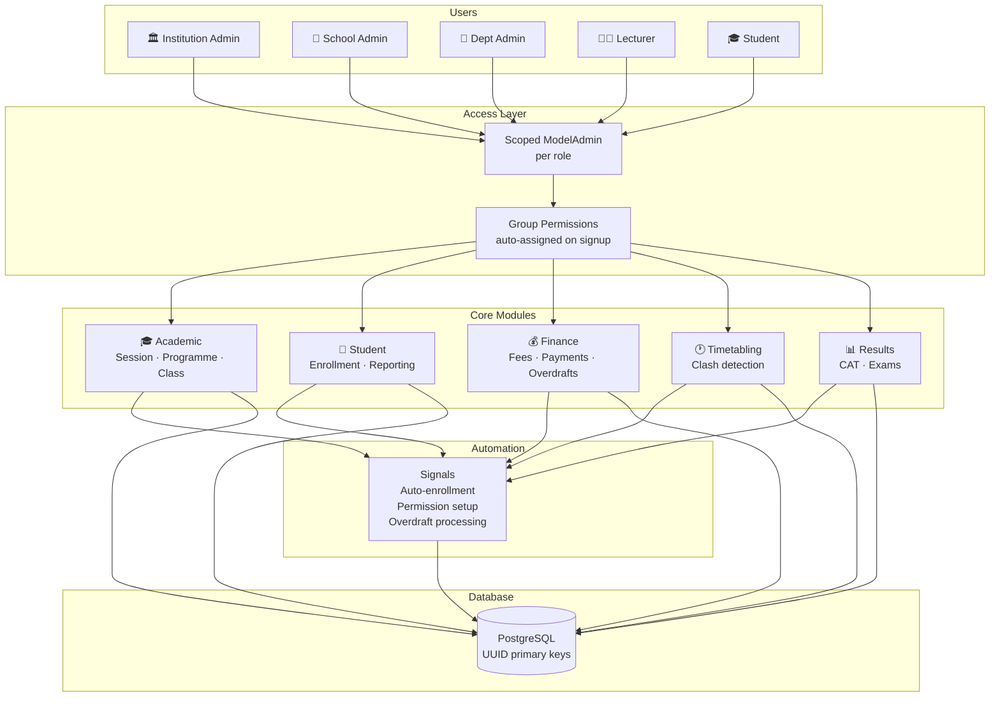

# 🏗️ Architecture Overview

> The big picture — how all the layers of the system fit together.

---

## 🗺️ System Map



---

## 📦 Module Breakdown

### 🎓 Academic Module

Manages the institution's academic structure and calendar.

```
Institution
└── School
    └── Department
        └── Programme
            └── Tclass (Class)
                └── Curriculum (Course + Session + Lecturer)
```

### 👤 Student Module

Handles everything about a student's life at the institution.

```
Student Profile     personal, family, emergency contacts
Reporting           check-in per session
Enrollments         M2M to Curriculum
Deferral            boolean flag + signal handling
Graduation          date field + proxy model view
```

### 💰 Finance Module

Tracks fees and payments with full audit trail.

```
FeeStructure        what a class owes per session (JSON breakdown)
StudentFeeAccount   per-student ledger (balance, is_cleared)
Payment             individual transactions (M-Pesa, bank, cash)
OverDraft           overpayment tracking (pending → carried/refunded)
```

### 🕐 Timetabling Module

Schedules classes and prevents conflicts.

```
Timetable           session + class + course + lecturer + venue + time
Constraints         no double-booking a venue or lecturer at same time
```

---

## 🔑 Key Design Decisions

| Decision                       | Reason                                                                   |
| ------------------------------ | ------------------------------------------------------------------------ |
| 🔑 UUID primary keys           | Security — no sequential IDs exposed in URLs                             |
| 🗓️ Institution-wide session    | All modules reference one active session — simpler and consistent        |
| ⚡ Signal-driven enrollment    | Decouples student creation from enrollment logic                         |
| 🪟 Proxy models                | Multiple admin views of same table without duplicating data              |
| 💰 Overdraft as separate model | Full audit trail — every cent is accounted for                           |
| 🔒 Scoped admin                | Each role sees only their jurisdiction — no extra config needed per user |

---

> 🔗 See the [ER Diagram](er-diagram.md) for the full database schema
> 🔗 Back to [Project Index](../README.md)
> 🔗 Back to [Documentation Index](./README.md)
