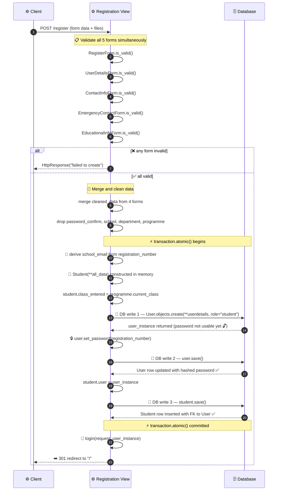

# 🎓 Student Registration — How It Works

This document describes the student registration flow in plain language. It covers what
happens when a registration form is submitted, how the system validates the data, and
the exact sequence in which records are written to the database.

---

## 📋 Overview

When a student submits the registration form, the system processes data across **five
distinct forms** before anything is written to the database. All database writes happen
inside a single atomic transaction, meaning if any step fails, every prior write in
that request is rolled back automatically — no partial records are left behind.

---

## 🗂️ The five forms

The registration submission is split across five forms, each responsible for a
different slice of the student's data:

| Form                          | Responsibility                                    |
| ----------------------------- | ------------------------------------------------- |
| 🔑 `RegisterForm`             | Login credentials                                 |
| 👤 `UserDetailsForm`          | Personal details and profile photo upload         |
| 📞 `ContactInfoForm`          | Address and contact information                   |
| 🚨 `EmergencyContactInfoForm` | Emergency contact details                         |
| 🏫 `EducationalInfoForm`      | Registration number, programme, and academic info |

> **Note:** `UserDetailsForm` is handled separately from the others throughout this
> flow. Its data goes directly into the `User` model, not the `Student` model.

---

## ✅ Step 1 — Validation

All five forms are validated simultaneously before any processing begins. The system
does **not** validate them one at a time — it runs all validations in parallel and
checks whether every single one passed.

If **any** form fails validation, the system logs all form errors to the console and
returns a failure response to the client immediately. No database interaction occurs.

Only when all five forms pass validation does the system proceed to the next step.

---

## 🧹 Step 2 — Data preparation

Once validation passes, the system merges the cleaned data from four of the five forms
into a single dictionary. The four forms merged are `RegisterForm`, `ContactInfoForm`,
`EmergencyContactInfoForm`, and `EducationalInfoForm`.

`UserDetailsForm` is deliberately excluded from this merge — it travels separately to
the `User` model.

Four fields are then removed from the merged dictionary because they are not actual
database model fields and would cause errors if passed directly to the model
constructor:

- `password_confirm`
- `school`
- `department`
- `programme`

---

## ⚡ Step 3 — Atomic transaction

Everything below happens inside a single atomic transaction. If a `DatabaseError` is
raised at any point, all writes are rolled back and the system returns a database error
response to the client.

### 📧 3a — School email derivation

Before any database writes, the system derives the student's institutional email
address from their registration number. The registration number is expected to follow
the format `PREFIX/NUMBER/YEAR` (e.g. `ABC/001/2023`). The system splits this on the
slash character, uppercases the first segment, and concatenates it with the second
segment to produce the email address:

```
ABC/001/2023  →  ABC001@institution.com
```

This value is stored as `school_email` and included in the student record.

### 🧠 3b — Student instance prepared in memory

A `Student` model instance is constructed from the merged data dictionary. At this
stage it exists only in memory — it has not been saved to the database yet, and it has
no linked user account.

The system also reads the `current_class` from the submitted programme and assigns it
to the student's `class_entered` field.

### 💾 3c — DB write 1: User record created

The system creates the `User` record using the data from `UserDetailsForm`, with the
`role` field hardcoded to `"student"`. This is the first write to the database. The
returned user instance does not yet have a usable password.

### 🔒 3d — DB write 2: Password hashed and saved

The system calls `set_password()` on the new user instance, using the student's
registration number as the initial password value. This hashes the value using
Django's configured password hasher. A second `save()` call then writes the hashed
password back to the user row.

> **Note for integrators:** The initial password is set to the registration number.
> This is intended as a temporary credential. It is strongly recommended to prompt
> the student to change their password on first login.

### 🎓 3e — DB write 3: Student record saved

With a valid `User` record now in the database, the system assigns the user instance
to the student object and calls `save()`. This inserts the `Student` row with a proper
foreign key reference to the `User` created in write 1.

---

## 🏁 Step 4 — Session and redirect

After the transaction completes successfully, the system logs the student in
immediately — they do not need to sign in separately after registering. The client is
then sent a permanent redirect to the home page.

---

## 🔀 Full sequence diagram



---

## ⚠️ Known limitations and integration notes

| #   | ⚠️ Item                         | Detail                                                                                                                                                                                                               |
| --- | ------------------------------- | -------------------------------------------------------------------------------------------------------------------------------------------------------------------------------------------------------------------- |
| 1   | **Write order dependency**      | The `Student` record cannot be saved before the `User` record exists. The foreign key is assigned in memory and only written on the third DB call. Any refactor must preserve this order.                            |
| 2   | **Initial password**            | The student's password is set to their registration number. This is a temporary credential and should be changed on first login.                                                                                     |
| 3   | **Registration number parsing** | The email derivation uses only the first two segments of the registration number after splitting on `/`. A third segment (e.g. the year) is silently ignored. If the format changes, this logic will need updating.  |
| 4   | **Error handling scope**        | Only `DatabaseError` is caught explicitly. Exceptions such as `IntegrityError` (e.g. a duplicate email or violated unique constraint) are **not** caught and will result in an unhandled 500 error.                  |
| 5   | **UserDetailsForm isolation**   | The data from `UserDetailsForm` is never merged into the shared dictionary. It is passed directly and exclusively to `User.objects.create()`. Do not move it into the merge without also updating the Student model. |
