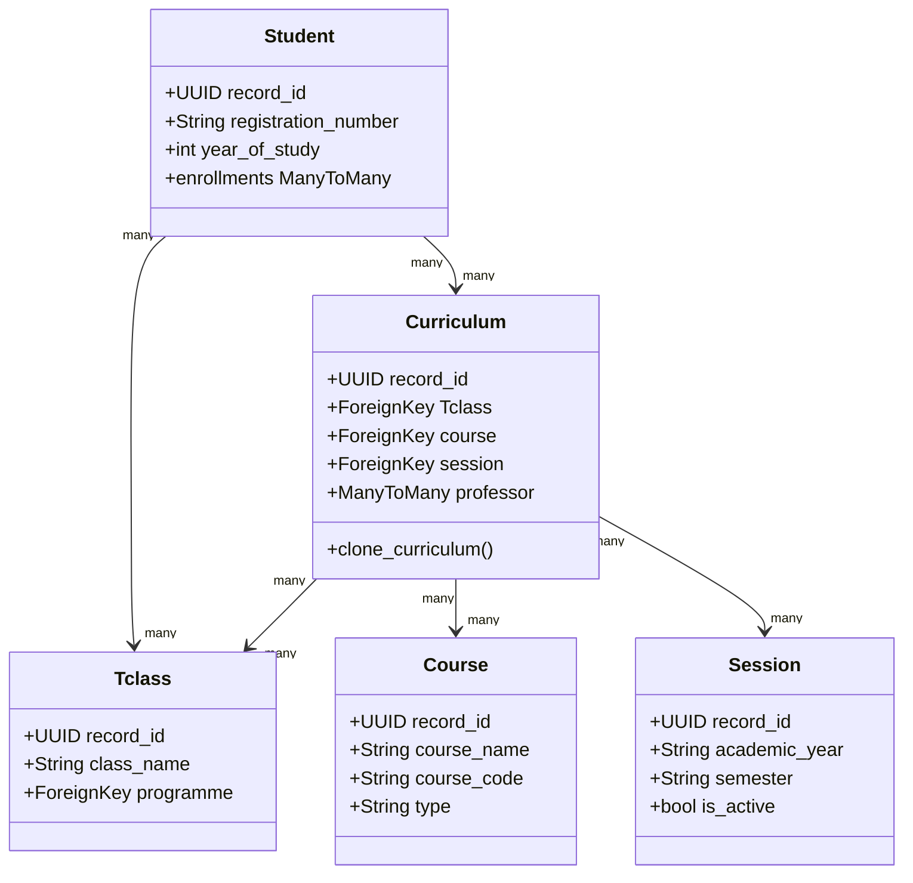

# 🏗️ Enrollment Class Diagram

> Model structure and relationships involved in enrollment.

---

```mermaid
classDiagram
    class Student {
        +UUID record_id
        +String registration_number
        +int year_of_study
        +enrollments ManyToMany
    }
    class Curriculum {
        +UUID record_id
        +ForeignKey Tclass
        +ForeignKey course
        +ForeignKey session
        +ManyToMany professor
        +clone_curriculum()
    }
    class Tclass {
        +UUID record_id
        +String class_name
        +ForeignKey programme
    }
    class Course {
        +UUID record_id
        +String course_name
        +String course_code
        +String type
    }

    class Session {
        +UUID record_id
        +String academic_year
        +String semester
        +bool is_active
    }

    Student "many" --> "many" Curriculum
    Student "many" --> "many"Tclass
    Curriculum "many" --> "many" Tclass
    Curriculum "many" --> "many" Course
    Curriculum "many" --> "many" Session
```

---

> 🔗 Back to [Enrollment Module](index.md)
