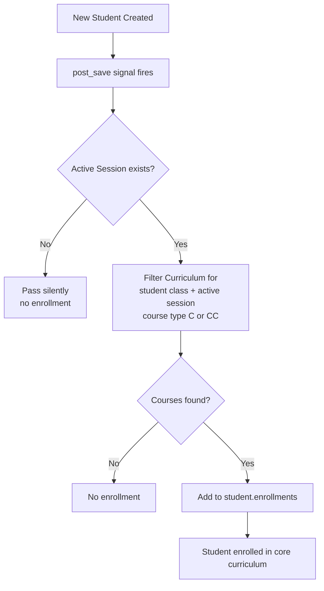
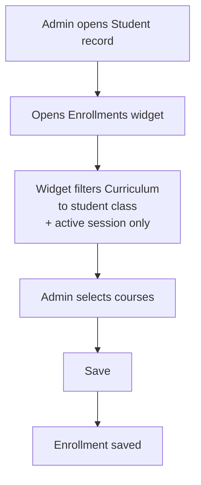

# 🔀 Enrollment Flowchart

> Step-by-step logic for how students get enrolled into courses.

---

## ⚡ Auto-Enrollment on Registration

---

## 🖱️ Manual Enrollment via Admin

---

## 📌 Notes

- ⚠️ Auto-enrollment only runs on **creation** — not on updates
- 🔒 Enrollment widget scoped to student's class and active session
- 📚 Course types: `C` = Core, `E` = Elective, `CC` = Common Unit
- ⚡ Signal lives in `signals.py`, loaded via `apps.py` ready()

---

> 🔗 Back to [Enrollment Module](index.md)
