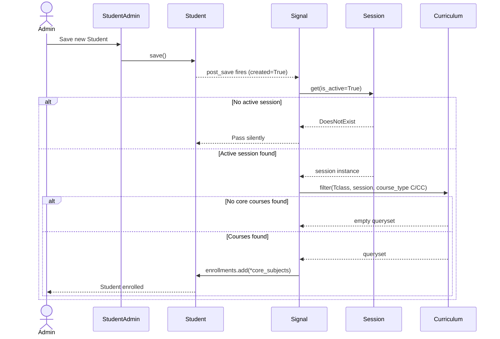
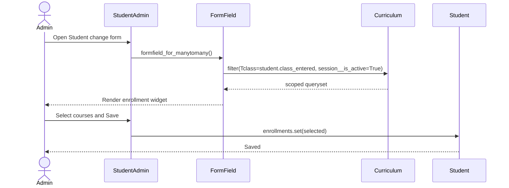

# 🔁 Enrollment Sequence Diagram

> How the signal, models, and database interact during enrollment.

---

## ⚡ Auto-Enrollment Sequence

---

## 🖱️ Manual Enrollment Sequence

---

> 🔗 Back to [Enrollment Module](index.md)
