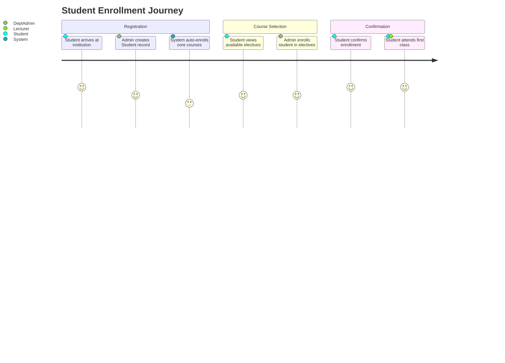
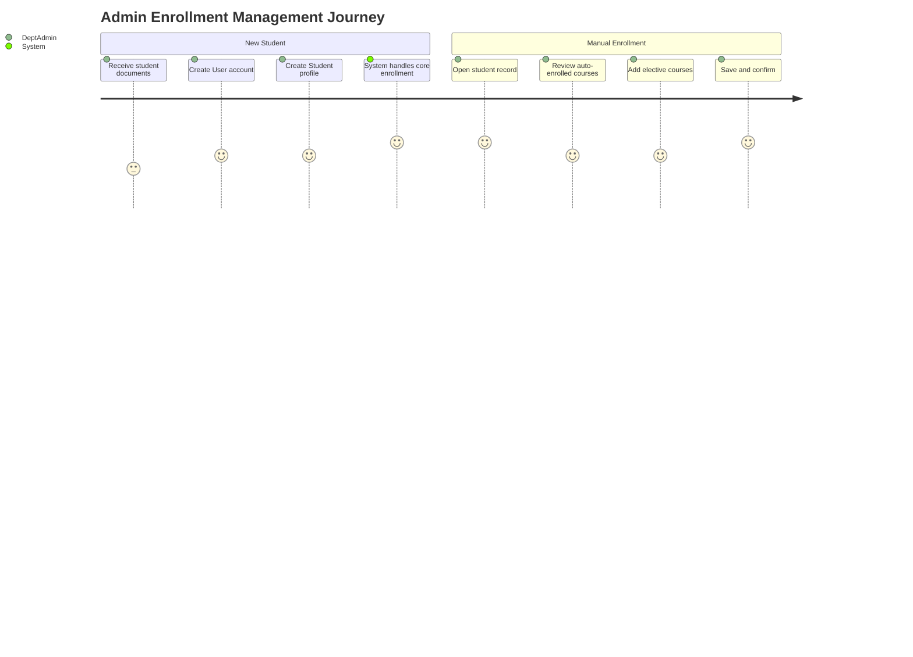

# 🗺️ Enrollment User Journey

> What the student and admin experience through the enrollment process.

---

## 🎓 Student Journey

---

## 👨‍💼 Admin Journey

---

> 🔗 Back to [Enrollment Module](index.md)
