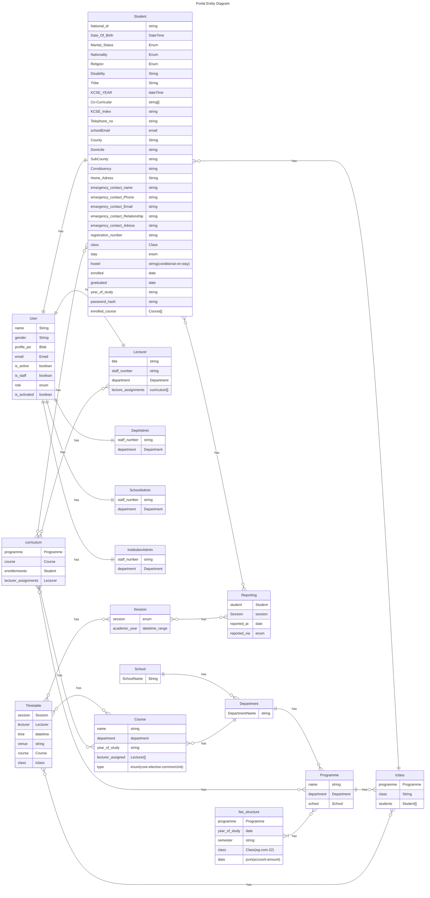

# 🗃️ Database Schema

> The full entity relationship diagram for the School Management System.
> Every table, every relationship, all in one place.

---

## 📊 ER Diagram

---

## 🔑 Key Relationships Explained

**👤 User → Profiles**
Every user has exactly one profile depending on their role.
A `Student` user has a `Student` profile, a `Staff` user becomes a `Lecturer`, an `Admin` becomes a `DeptAdmin`, `SchoolAdmin`, or `InstitutionAdmin`.

**🎓 Student → Class → Programme → Department → School**
The full academic hierarchy chain. A student belongs to a class, which belongs to a programme, which belongs to a department, which belongs to a school.

**💰 Fee Flow**
`FeeStructure` defines what a class owes per session →
`StudentFeeAccount` is the per-student ledger →
`Payment` records individual transactions →
`OverDraft` captures any overpayment for carry-forward or refund.

---

> 🔗 Back to [Project Index](../README.md)
> 🔗 Back to [Documentation Index](./README.md)
