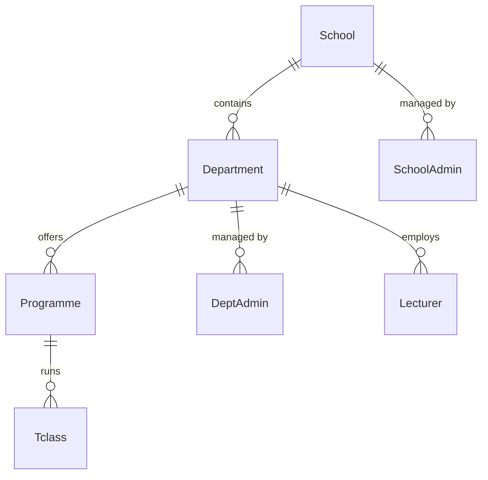
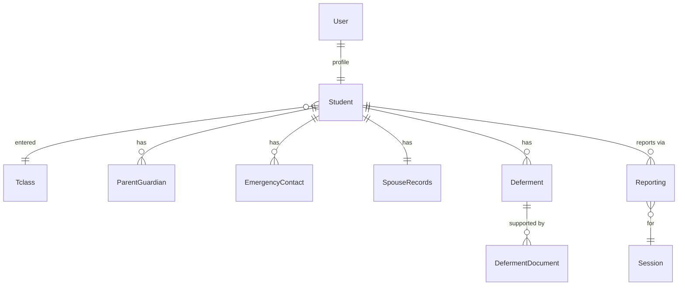
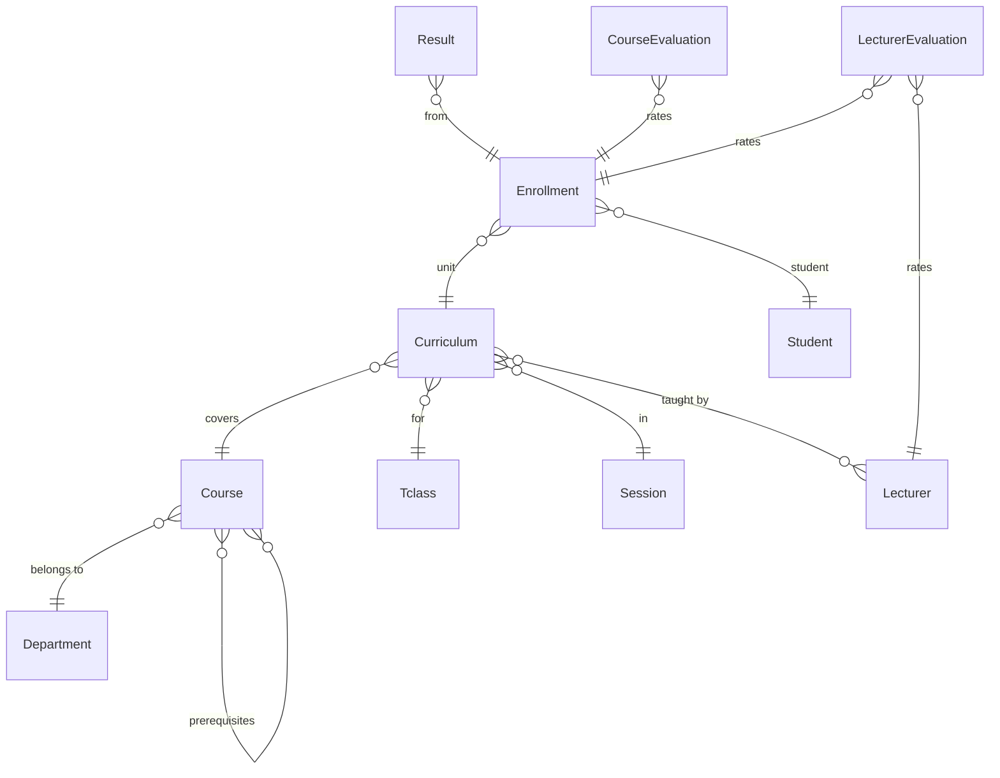
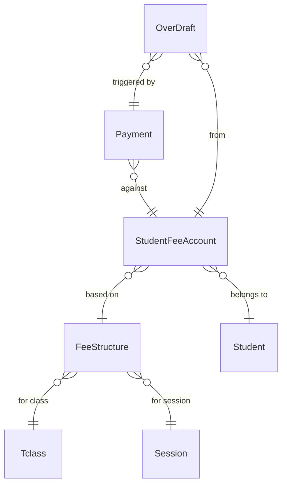
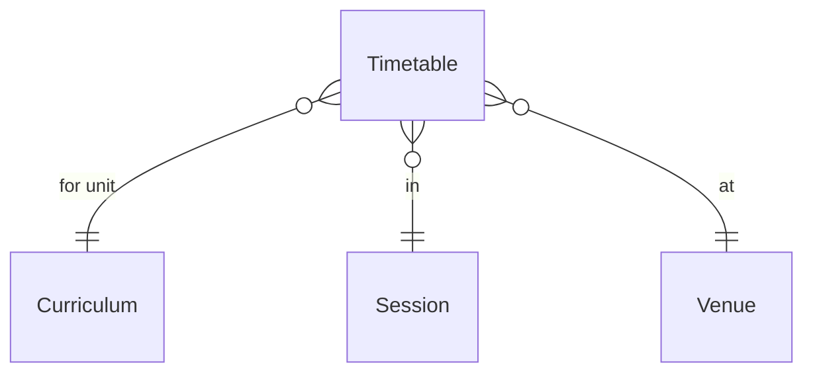
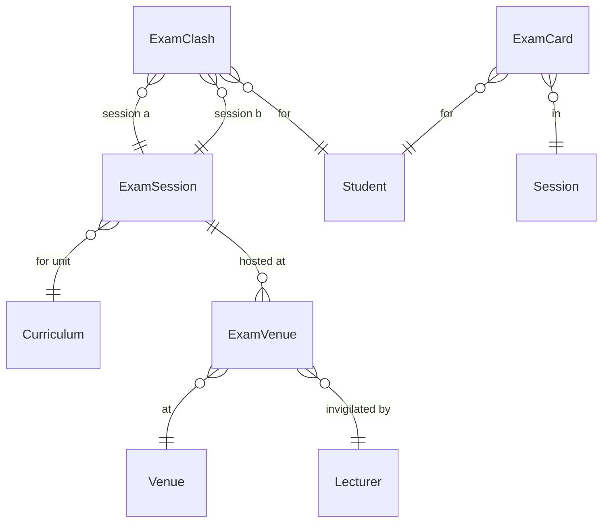
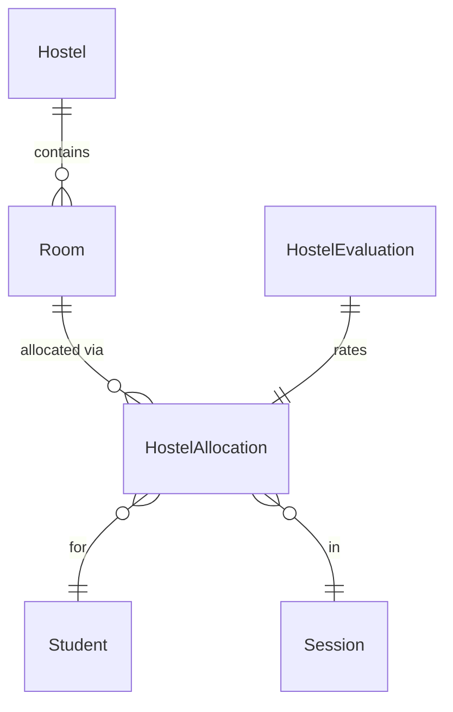

# 🗃️ Database Schema

> The full entity relationship diagram for Naet
> Every table, every relationship, all in one place.

---

## 📊 ER Diagram

## 1. Institutional hierarchy

```mermaid
erDiagram
  direction TB
  School ||--o{ Department : "contains"
  Department ||--o{ Programme : "offers"
  Programme ||--o{ Tclass : "runs"
  School ||--o{ SchoolAdmin : "managed by"
  Department ||--o{ DeptAdmin : "managed by"
  Department ||--o{ Lecturer : "employs"
```

## 2. Student — personal & admissions

```mermaid
erDiagram
  User ||--|| Student : "profile"
  Student }o--|| Tclass : "entered"
  Student ||--o{ ParentGuardian : "has"
  Student ||--o{ EmergencyContact : "has"
  Student ||--|| SpouseRecords : "has"
  Student ||--o{ Deferment : "has"
  Deferment ||--o{ DefermentDocument : "supported by"
  Student ||--o{ Reporting : "reports via"
  Reporting }o--|| Session : "for"
```

## 3. Academic — curriculum, enrollment, results

```mermaid
erDiagram
  direction TB
  Course }o--|| Department : "belongs to"
  Course }o--o{ Course : "prerequisites"
  Curriculum }o--|| Course : "covers"
  Curriculum }o--|| Tclass : "for"
  Curriculum }o--|| Session : "in"
  Curriculum }o--o{ Lecturer : "taught by"
  Enrollment }o--|| Student : "student"
  Enrollment }o--|| Curriculum : "unit"
  Result }o--|| Enrollment : "from"
  CourseEvaluation }o--|| Enrollment : "rates"
  LecturerEvaluation }o--|| Enrollment : "rates"
  LecturerEvaluation }o--|| Lecturer : "rates"
```

## 4. Finance — fees and payments

```mermaid
erDiagram
  FeeStructure }o--|| Tclass : "for class"
  FeeStructure }o--|| Session : "for session"
  StudentFeeAccount }o--|| Student : "belongs to"
  StudentFeeAccount }o--|| FeeStructure : "based on"
  Payment }o--|| StudentFeeAccount : "against"
  OverDraft }o--|| StudentFeeAccount : "from"
  OverDraft }o--|| Payment : "triggered by"
```

## 5. Timetabling

```mermaid
erDiagram
  Timetable }o--|| Curriculum : "for unit"
  Timetable }o--|| Session : "in"
  Timetable }o--|| Venue : "at"


```

## 6. Exams

```mermaid
erDiagram
direction TB
ExamSession }o--|| Curriculum : "for unit"
ExamSession ||--o{ ExamVenue : "hosted at"
ExamVenue }o--|| Venue : "at"
ExamVenue }o--|| Lecturer : "invigilated by"
ExamClash }o--|| Student : "for"
ExamClash }o--|| ExamSession : "session a"
ExamClash }o--|| ExamSession : "session b"
ExamCard }o--|| Student : "for"
ExamCard }o--|| Session : "in"
```

## 7 Hostels

```mermaid
erDiagram
 Hostel ||--o{ Room : "contains"
  Room ||--o{ HostelAllocation : "allocated via"
  HostelAllocation }o--|| Student : "for"
  HostelAllocation }o--|| Session : "in"
  HostelEvaluation ||--|| HostelAllocation : "rates"
```

---

## 🔑 Key Relationships Explained

**👤 User → Profiles**
Every user has exactly one profile depending on their role.
A `Student` user has a `Student` profile, a `Staff` user becomes a `Lecturer`, an `Admin` becomes a `DeptAdmin`, `SchoolAdmin`, or `InstitutionAdmin`.

**🎓 Student → Class → Programme → Department → School**
The full academic hierarchy chain. A student belongs to a class, which belongs to a programme, which belongs to a department, which belongs to a school.

**💰 Fee Flow**
`FeeStructure` defines what a class owes per session →
`StudentFeeAccount` is the per-student ledger →
`Payment` records individual transactions

---

> 🔗 Back to [Project Index](../README.md)
> 🔗 Back to [Documentation Index](./README.md)
