# 🗃️ Database Schema

> The full entity relationship diagram for Naet
> Every table, every relationship, all in one place.
> Reconciled against the [Models Reference](models-reference.md) — 80+ models across 16 domains.

---

## 📊 ER Diagram

## 1. Core identity & staff

`User` is the single login/auth table. Every specialised staff role is its
own flat table hanging off `User` — there's no shared `StaffProfile` base
in this project's schema (see note below).

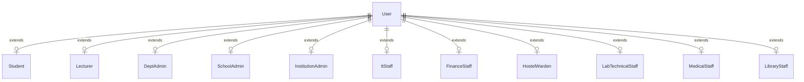
```mermaid
erDiagram
  direction TB
  User ||--o| Student : "extends"
  User ||--o| Lecturer : "extends"
  User ||--o| DeptAdmin : "extends"
  User ||--o| SchoolAdmin : "extends"
  User ||--o| InstitutionAdmin : "extends"
  User ||--o| ItStaff : "extends"
  User ||--o| FinanceStaff : "extends"
  User ||--o| HostelWarden : "extends"
  User ||--o| LabTechnicalStaff : "extends"
  User ||--o| MedicalStaff : "extends"
  User ||--o| LibraryStaff : "extends"
```

## 2. Institutional hierarchy

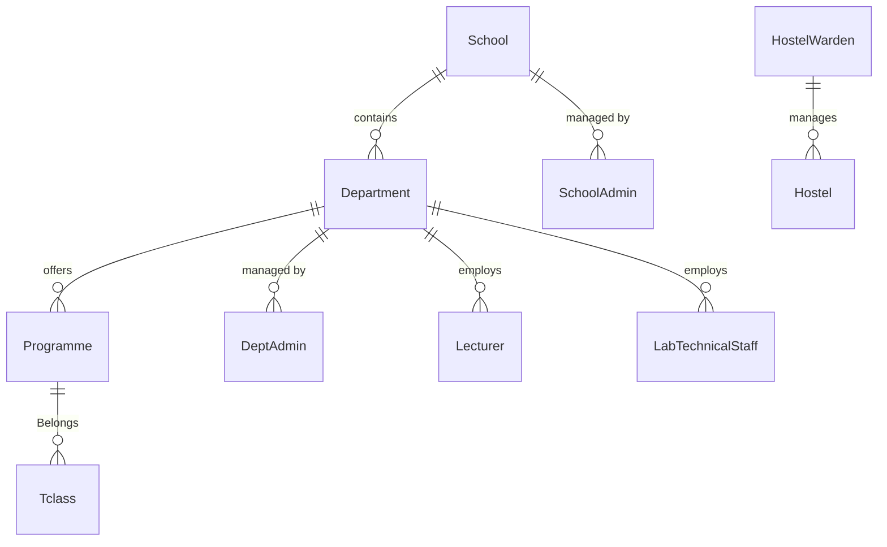
```mermaid
erDiagram
  direction TB
  School ||--o{ Department : "contains"
  Department ||--o{ Programme : "offers"
  Programme ||--o{ Tclass : "Belongs"
  School ||--o{ SchoolAdmin : "managed by"
  Department ||--o{ DeptAdmin : "managed by"
  Department ||--o{ Lecturer : "employs"
  Department ||--o{ LabTechnicalStaff : "employs"
  HostelWarden ||--o{ Hostel : "manages"
```

## 3. Admissions pipeline

The pipeline stage before a `Student` record exists — `Application` is
promoted into a `Student` once `status = enrolled`.

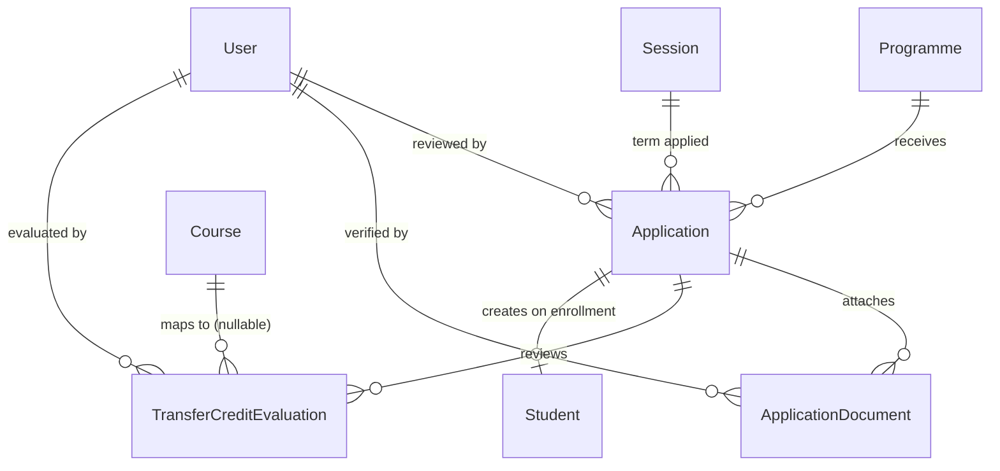
```mermaid
erDiagram
  direction TB
  Programme ||--o{ Application : "receives"
  Session ||--o{ Application : "term applied"
  Application ||--o{ ApplicationDocument : "attaches"
  Application ||--o{ TransferCreditEvaluation : "reviews"
  Course ||--o{ TransferCreditEvaluation : "maps to (nullable)"
  Application ||--o| Student : "creates on enrollment"
  User ||--o{ Application : "reviewed by"
  User ||--o{ ApplicationDocument : "verified by"
  User ||--o{ TransferCreditEvaluation : "evaluated by"
```

## 4. Academic — curriculum, enrollment, results & evaluations

`CommonUnitCurriculum` is a proxy over `Curriculum` (common-unit courses
only) — no separate table, so it isn't drawn as its own node.

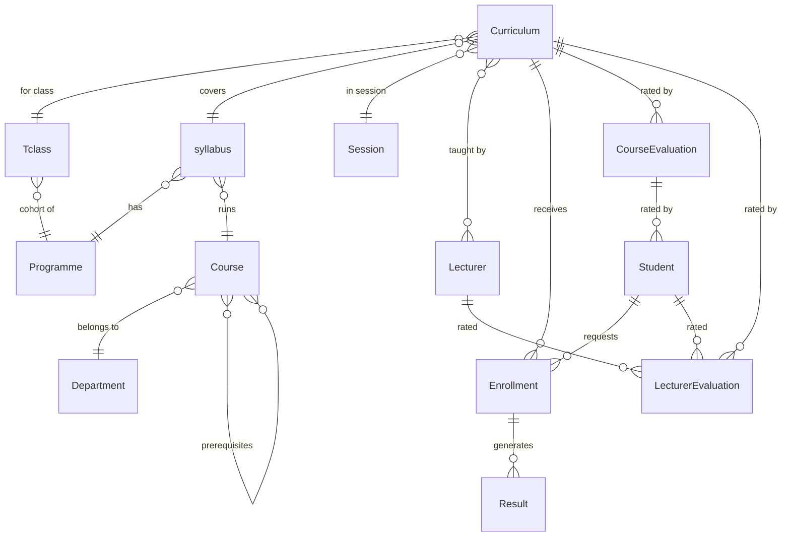
```mermaid
erDiagram
  direction TB
  Course }o--|| Department : "belongs to"
  Course }o--o{ Course : "prerequisites"
  syllabus }o--|| Programme : "has"
  syllabus }o--|| Course : "runs"

  Tclass }o--|| Programme : "cohort of"
  Curriculum }o--|| Tclass : "for class"
  Curriculum }o--|| syllabus : "covers"
  Curriculum }o--|| Session : "in session"
  Curriculum }o--o{ Lecturer : "taught by"
  Curriculum ||--o{ Enrollment : "receives"
  Student ||--o{ Enrollment : "requests"
  Enrollment ||--o{ Result : "generates"
  Curriculum ||--o{ CourseEvaluation : "rated by"
  CourseEvaluation ||--o{ Student : "rated by"
  Curriculum ||--o{ LecturerEvaluation : "rated by"
  Lecturer ||--o{ LecturerEvaluation : "rated"
  Student ||--o{ LecturerEvaluation : "rated"
```

> 🔧 `Curriculum.professor` is a plain M2M today. If per-lecturer workload
> or primary/assisting distinction is needed, route it through
> `LecturerAssignment` instead (`unique_together: curriculum, lecturer`;
> only one `is_primary=True` per curriculum entry).

## 5. Sessions, reporting & deferment

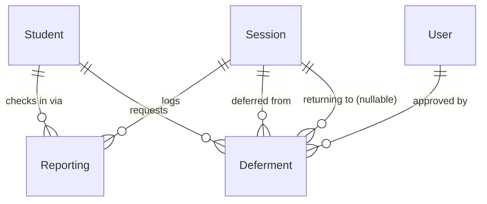
```mermaid
erDiagram
  direction TB
  Session ||--o{ Reporting : "logs"
  Student ||--o{ Reporting : "checks in via"
  Student ||--o{ Deferment : "requests"
  Session ||--o{ Deferment : "deferred from"
  Session ||--o{ Deferment : "returning to (nullable)"
  User ||--o{ Deferment : "approved by"
```

## 6. Student profile extensions

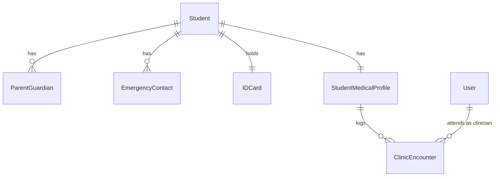
```mermaid
erDiagram
  direction TB
  Student ||--o{ ParentGuardian : "has"
  Student ||--o{ EmergencyContact : "has"
  Student ||--|| IDCard : "holds"
  Student ||--|| StudentMedicalProfile : "has"
  StudentMedicalProfile ||--o{ ClinicEncounter : "logs"
  User ||--o{ ClinicEncounter : "attends as clinician"
```

## 7. Complaints & status changes

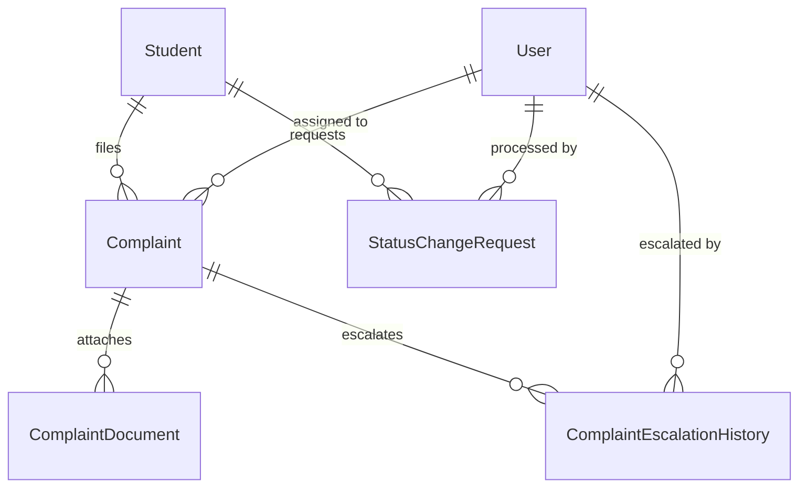
```mermaid
erDiagram
  direction TB
  Student ||--o{ Complaint : "files"
  Complaint ||--o{ ComplaintDocument : "attaches"
  Complaint ||--o{ ComplaintEscalationHistory : "escalates"
  User ||--o{ Complaint : "assigned to"
  User ||--o{ ComplaintEscalationHistory : "escalated by"
  Student ||--o{ StatusChangeRequest : "requests"
  User ||--o{ StatusChangeRequest : "processed by"
```

> ⚠️ `Complaint` (registrar/Dean of Students channel) and `Grievance`
> (student-council/welfare channel, see §14) are near-duplicate concepts
> entering through different doors — pick a canonical one, or route an
> unresolved `Grievance` into a `Complaint` on escalation, rather than
> keeping two disconnected pipelines.

## 8. Degree audit & graduation

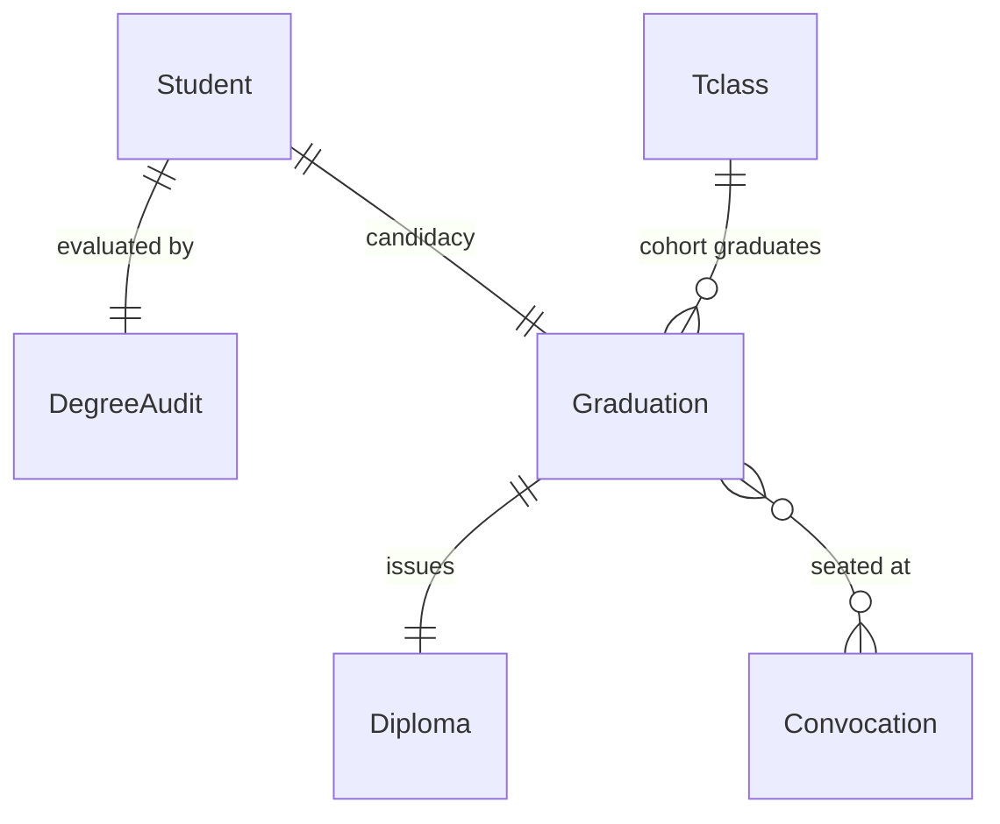
```mermaid
erDiagram
  direction TB
  Student ||--|| DegreeAudit : "evaluated by"
  Student ||--|| Graduation : "candidacy"
  Tclass ||--o{ Graduation : "cohort graduates"
  Graduation ||--|| Diploma : "issues"
  Graduation }o--o{ Convocation : "seated at"
```

> ⚠️ `DegreeAudit` is a single `OneToOneField` — rerunning it overwrites
> the previous result with no history. Add a `DegreeAuditRun` log model
> if "what did the audit say last term" needs to be answerable.

## 9. Finance — fees & payments

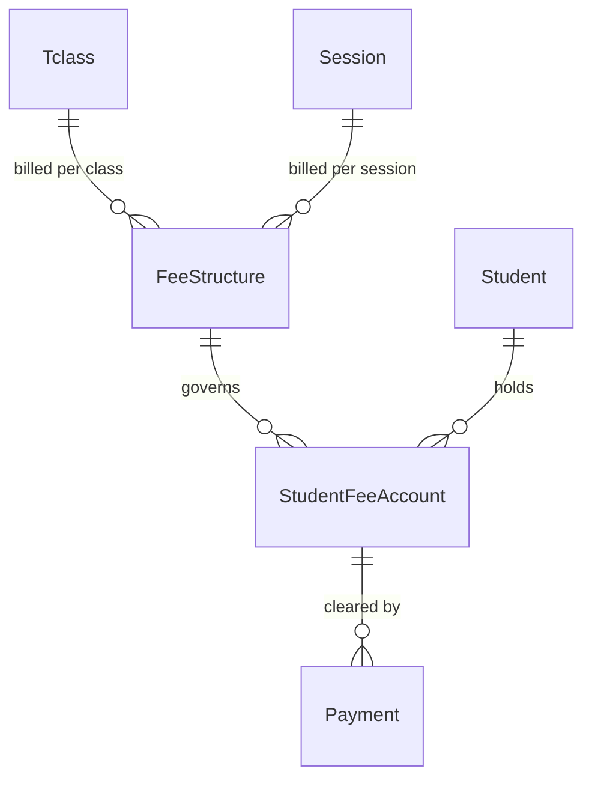
```mermaid
erDiagram
  direction TB
  Tclass ||--o{ FeeStructure : "billed per class"
  Session ||--o{ FeeStructure : "billed per session"
  FeeStructure ||--o{ StudentFeeAccount : "governs"
  Student ||--o{ StudentFeeAccount : "holds"
  StudentFeeAccount ||--o{ Payment : "cleared by"
```

`StudentFeeAccount` derives its `session` via `fee_structure.session` —
there's no direct FK to `Session` on the account itself.

## 10. Campus infrastructure & class scheduling

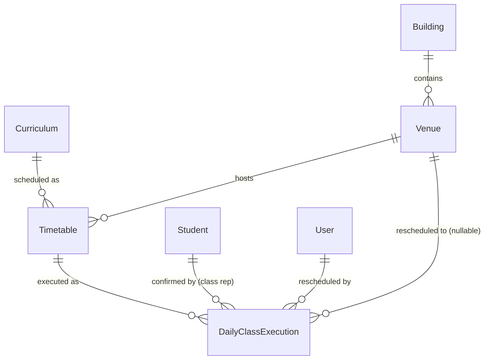
```mermaid
erDiagram
  direction TB
  Building ||--o{ Venue : "contains"
  Curriculum ||--o{ Timetable : "scheduled as"
  Venue ||--o{ Timetable : "hosts"
  Timetable ||--o{ DailyClassExecution : "executed as"
  Student ||--o{ DailyClassExecution : "confirmed by (class rep)"
  User ||--o{ DailyClassExecution : "rescheduled by"
  Venue ||--o{ DailyClassExecution : "rescheduled to (nullable)"
```

`Timetable` no longer carries direct FKs to `Session`/`Tclass`/`Course`/
`Lecturer` — all of that is derived through the linked `Curriculum` entry.

## 11. Examinations & invigilation

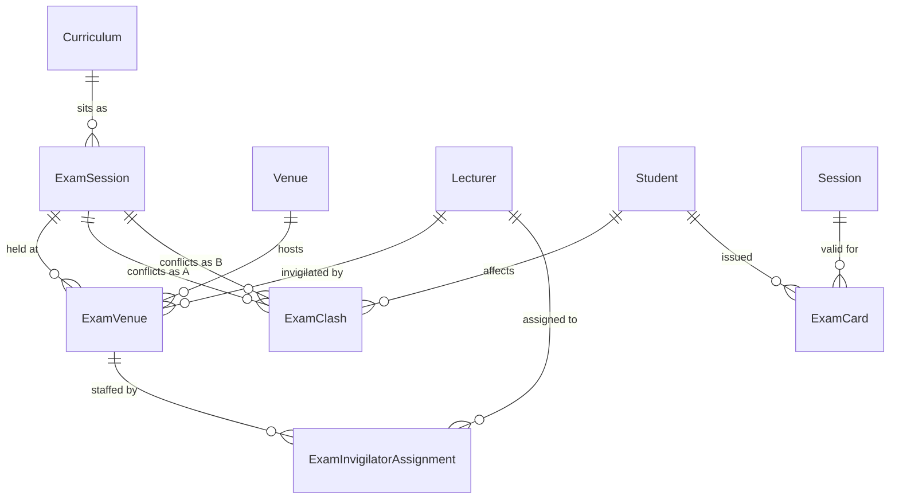
```mermaid
erDiagram
  direction TB
  Curriculum ||--o{ ExamSession : "sits as"
  ExamSession ||--o{ ExamVenue : "held at"
  Venue ||--o{ ExamVenue : "hosts"
  Lecturer ||--o{ ExamVenue : "invigilated by"
  ExamVenue ||--o{ ExamInvigilatorAssignment : "staffed by"
  Lecturer ||--o{ ExamInvigilatorAssignment : "assigned to"
  ExamSession ||--o{ ExamClash : "conflicts as A"
  ExamSession ||--o{ ExamClash : "conflicts as B"
  Student ||--o{ ExamClash : "affects"
  Student ||--o{ ExamCard : "issued"
  Session ||--o{ ExamCard : "valid for"
```

> 🔧 `ExamVenue.invigilator` is a single FK today — one invigilator per
> venue. For a chief + assistants squad, route it through
> `ExamInvigilatorAssignment` instead (only one active `role=Chief` per
> venue; a lecturer can't be double-booked at the same date/time slot).

## 12. Hostels & housing

`HostelListing` is a student-facing off-campus housing directory — it has
no FK relationship to the on-campus `Hostel`/`Room`/`HostelAllocation`
chain, so it's drawn standalone.

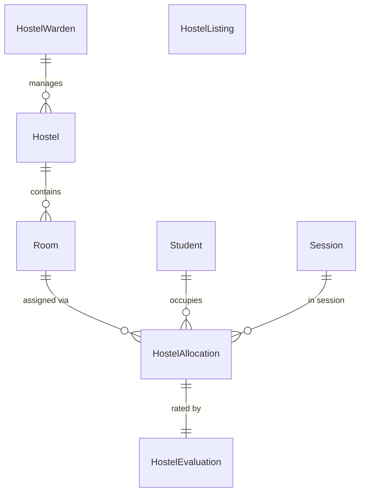
```mermaid
erDiagram
  direction TB
  Hostel ||--o{ Room : "contains"
  Room ||--o{ HostelAllocation : "assigned via"
  Student ||--o{ HostelAllocation : "occupies"
  Session ||--o{ HostelAllocation : "in session"
  HostelAllocation ||--|| HostelEvaluation : "rated by"
  HostelWarden ||--o{ Hostel : "manages"

  HostelListing
```

## 13. Clubs & societies

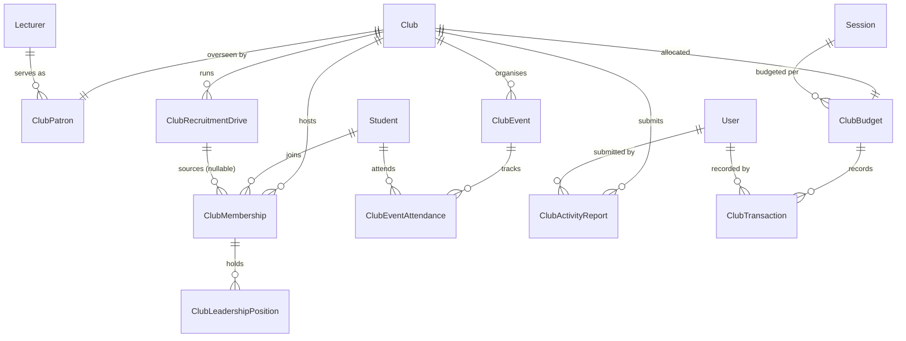
```mermaid
erDiagram
  direction TB
  Club ||--|| ClubPatron : "overseen by"
  Lecturer ||--o{ ClubPatron : "serves as"
  Club ||--o{ ClubRecruitmentDrive : "runs"
  Club ||--o{ ClubMembership : "hosts"
  Student ||--o{ ClubMembership : "joins"
  ClubRecruitmentDrive ||--o{ ClubMembership : "sources (nullable)"
  ClubMembership ||--o{ ClubLeadershipPosition : "holds"
  Club ||--o{ ClubEvent : "organises"
  ClubEvent ||--o{ ClubEventAttendance : "tracks"
  Student ||--o{ ClubEventAttendance : "attends"
  Club ||--o{ ClubActivityReport : "submits"
  User ||--o{ ClubActivityReport : "submitted by"
  Club ||--|| ClubBudget : "allocated"
  Session ||--o{ ClubBudget : "budgeted per"
  ClubBudget ||--o{ ClubTransaction : "records"
  User ||--o{ ClubTransaction : "recorded by"
```

## 14. Student council & governance

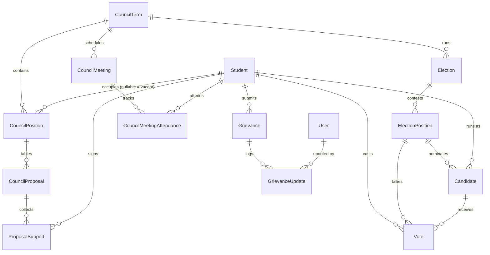
```mermaid
erDiagram
  direction TB
  CouncilTerm ||--o{ CouncilPosition : "contains"
  Student ||--o{ CouncilPosition : "occupies (nullable = vacant)"
  CouncilTerm ||--o{ Election : "runs"
  Election ||--o{ ElectionPosition : "contests"
  ElectionPosition ||--o{ Candidate : "nominates"
  Student ||--o{ Candidate : "runs as"
  Student ||--o{ Vote : "casts"
  ElectionPosition ||--o{ Vote : "tallies"
  Candidate ||--o{ Vote : "receives"
  CouncilPosition ||--o{ CouncilProposal : "tables"
  CouncilProposal ||--o{ ProposalSupport : "collects"
  Student ||--o{ ProposalSupport : "signs"
  CouncilTerm ||--o{ CouncilMeeting : "schedules"
  CouncilMeeting ||--o{ CouncilMeetingAttendance : "tracks"
  Student ||--o{ CouncilMeetingAttendance : "attends"
  Student ||--o{ Grievance : "submits"
  Grievance ||--o{ GrievanceUpdate : "logs"
  User ||--o{ GrievanceUpdate : "updated by"
```

## 15. Compliance & regulatory

`ComplianceCalendarEvent` is a denormalized projection over the three
deadline-bearing tables below — regenerate it via a signal/management
command when a source record's dates change, don't hand-maintain it.

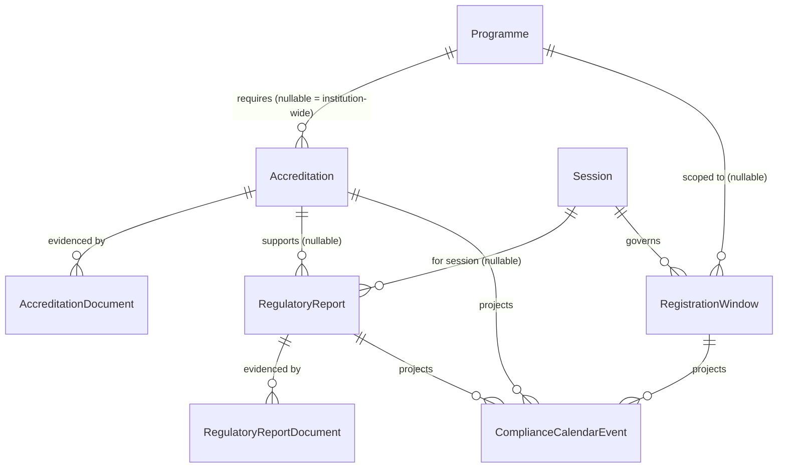
```mermaid
erDiagram
  direction TB
  Programme ||--o{ Accreditation : "requires (nullable = institution-wide)"
  Accreditation ||--o{ AccreditationDocument : "evidenced by"
  Accreditation ||--o{ RegulatoryReport : "supports (nullable)"
  Session ||--o{ RegulatoryReport : "for session (nullable)"
  RegulatoryReport ||--o{ RegulatoryReportDocument : "evidenced by"
  Session ||--o{ RegistrationWindow : "governs"
  Programme ||--o{ RegistrationWindow : "scoped to (nullable)"
  Accreditation ||--o{ ComplianceCalendarEvent : "projects"
  RegulatoryReport ||--o{ ComplianceCalendarEvent : "projects"
  RegistrationWindow ||--o{ ComplianceCalendarEvent : "projects"
```

## 16. Communications & broadcast

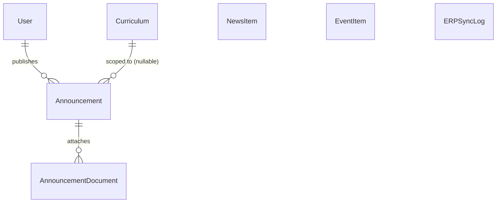
```mermaid
erDiagram
  direction TB
  User ||--o{ Announcement : "publishes"
  Curriculum ||--o{ Announcement : "scoped to (nullable)"
  Announcement ||--o{ AnnouncementDocument : "attaches"

  NewsItem
  EventItem
  ERPSyncLog
```

`NewsItem`, `EventItem`, and `ERPSyncLog` are standalone — card-data
synced from an external CMS/ERP rather than tables with internal FKs.

## 17. Leave

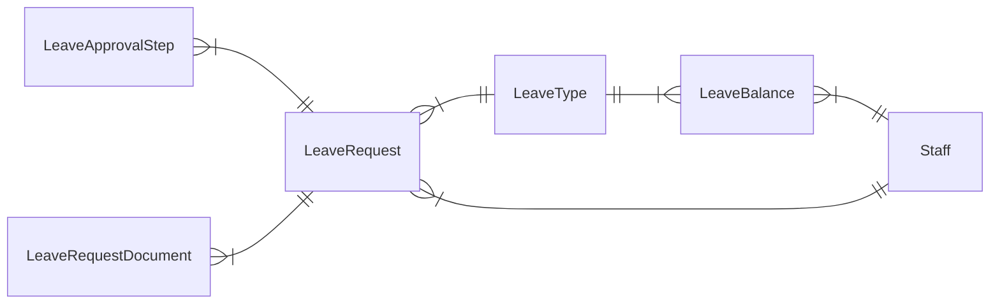
```mermaid
erDiagram
  direction LR
  LeaveType || -- |{   LeaveBalance : ""
  LeaveBalance }|--|| Staff : ""
  LeaveRequest }|--|| Staff : ""
  LeaveRequest }|--|| LeaveType : ""

  LeaveApprovalStep }| -- || LeaveRequest : " "
  LeaveRequestDocument }| -- || LeaveRequest : " "
```

---

## 🔑 Key Relationships Explained

**👤 User → Profiles**
Every user has exactly one profile depending on role — a `student` user
gets a `Student` profile, a `staff` user becomes a `Lecturer`/`ItStaff`/
`FinanceStaff`/etc., an `admin` user becomes a `DeptAdmin`, `SchoolAdmin`,
or `InstitutionAdmin`. There's no shared abstract base — see the note
under §1.

**🎓 Student → Class → Programme → Department → School**
The full academic hierarchy chain. A student belongs to a class, which
belongs to a programme, which belongs to a department, which belongs to a
school.

**📋 Curriculum is the hub, not Course/Tclass directly**
Enrollment, Result, Timetable, ExamSession, and both evaluation models all
hang off `Curriculum` (the course+class+session junction) rather than off
`Course` or `Tclass` directly — this is what lets the same course carry
different lecturers, schedules, and results per class per session.

**💰 Fee flow**
`FeeStructure` defines what a class owes per session →
`StudentFeeAccount` is the per-student ledger →
`Payment` records individual transactions.

**🏛️ Clubs vs. Council**
Both are student-organisation trees with the same shape (membership →
leadership → events → budget), but they're independent hierarchies:
`Club` is opt-in and per-society, `CouncilTerm` is the single campus-wide
governing body elected via `Election`.

---

## ⚠️ Notes & Caveats

A few things worth resolving before/while building against this schema
(pulled from the annotations scattered through the Models Reference):

- **Staff modeling is flat, not inherited.** `Lecturer`, `DeptAdmin`,
  `SchoolAdmin`, `InstitutionAdmin`, `ItStaff`, `FinanceStaff`,
  `HostelWarden`, `LabTechnicalStaff`, `MedicalStaff`, and `LibraryStaff`
  are eight independent tables, not subclasses of a shared `StaffProfile`.
  If a unified staff directory, contract tracking, or staff-number
  generation is needed later, all eight are candidates to inherit from a
  new shared abstract base at that point — not before.
- **`Complaint` and `Grievance` overlap** (see §7) — decide which channel
  is canonical, or connect them, before both ship to production.
- **`DegreeAudit` has no run history** (see §8) — rerunning it silently
  overwrites the prior result.
- **`School.active_session` is a likely removal candidate** — `Session`
  is institution-wide, so a session flag scoped to `School` is redundant
  with the single active `Session` row.
- **Two optional through-tables exist but aren't required**:
  `LecturerAssignment` (for `Curriculum.professor`, §4) and
  `ExamInvigilatorAssignment` (for `ExamVenue.invigilator`, §11). Both
  start as plain FK/M2M fields and only need swapping in if
  primary-vs-assistant tracking or multi-invigilator halls become a
  requirement.
- **`django-simple-history` tables aren't drawn.** Several models
  (`Deferment`, `Reporting`, `Complaint`, `Enrollment`, `Curriculum`,
  `StudentFeeAccount`, `Payment`, `Club`, `ClubPatron`, `ClubMembership`,
  `ClubActivityReport`, `ClubBudget`, `ClubTransaction`, `CouncilTerm`,
  `CouncilPosition`, `Candidate`, `Grievance`) each silently get a
  matching `Historical<ModelName>` table via `history = HistoricalRecords()`
  — automatic, not hand-modeled, and omitted here to keep the diagram
  readable. Query them via `Model.history.all()` / `instance.history.all()`.

---

> 🔗 Back to [Project Index](../README.md)
> 🔗 Back to [Documentation Index](./README.md)
> 🔗 See the [Models Reference](models-reference.md) for the full field-by-field data dictionary
