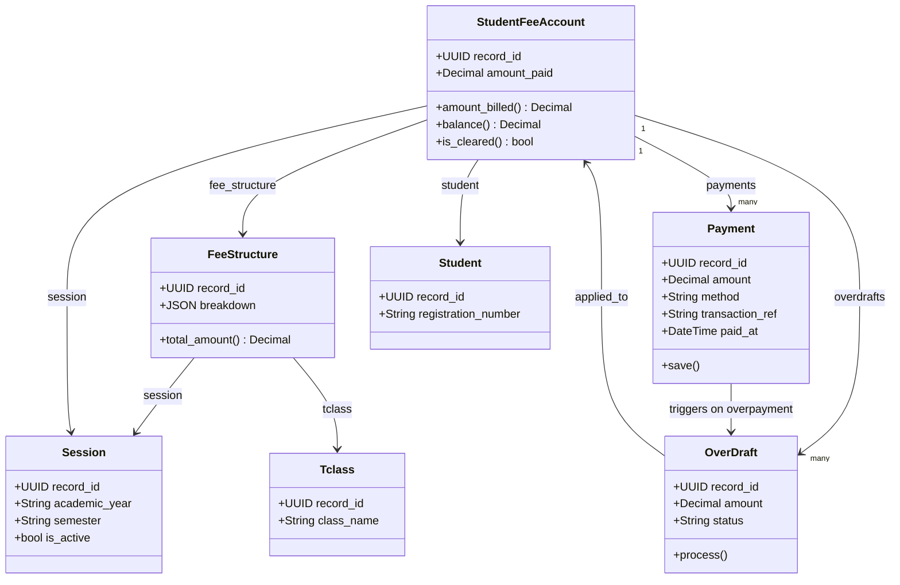

# 🏗️ Fees & Payments Class Diagram

> Model structure and relationships in the fee module.

---

---

## 📊 OverDraft Status Reference

| Status        | Meaning                                       |
| ------------- | --------------------------------------------- |
| ⏳ `pending`  | Just recorded, not yet processed              |
| ✅ `carried`  | Applied as credit to next session fee account |
| 💸 `refunded` | Flagged for manual refund                     |

---

> 🔗 Back to [Fees Module](index.md)
