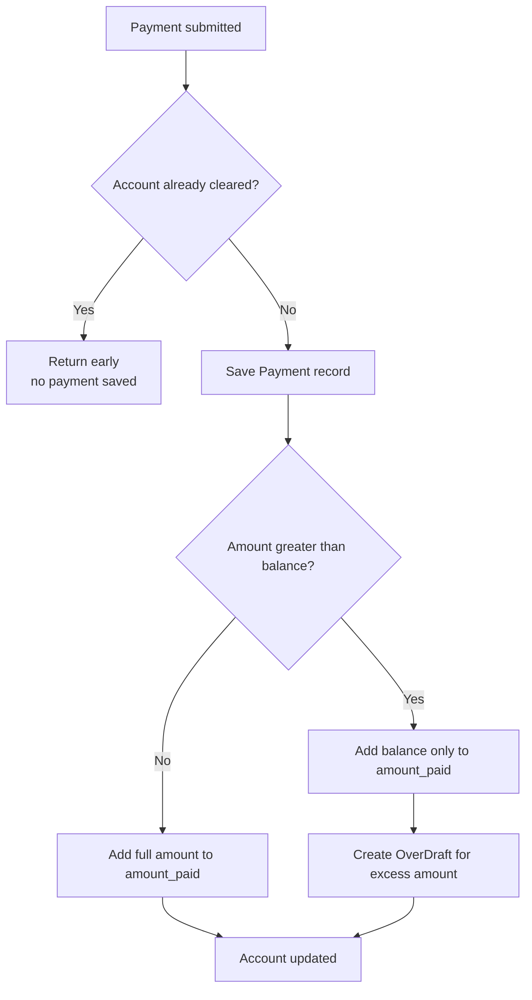
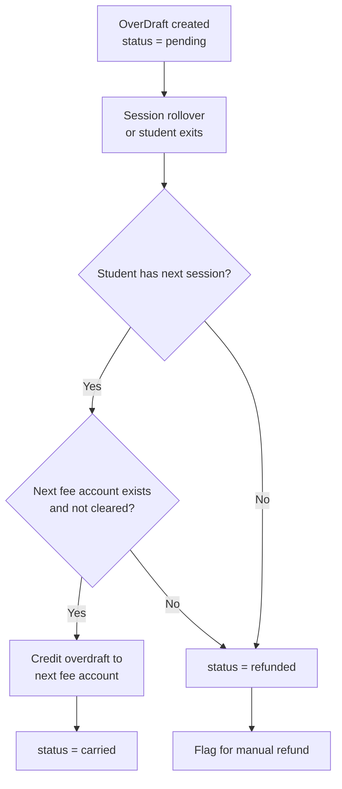

# 🔀 Fees & Payments Flowchart

> Step-by-step payment processing and overdraft logic.

---

## 💳 Payment Processing

```mermaid
flowchart TD
    A[Payment submitted] --> B{Account already cleared?}
    B -- Yes --> C[Return early\nno payment saved]
    B -- No --> D[Save Payment record]
    D --> E{Amount greater than balance?}
    E -- No --> F[Add full amount to amount_paid]
    E -- Yes --> G[Add balance only to amount_paid]
    G --> H[Create OverDraft for excess amount]
    F --> I[Account updated]
    H --> I
```

---

## ⚠️ Overdraft Processing

```mermaid
flowchart TD
    A[OverDraft created\nstatus = pending] --> B[Session rollover\nor student exits]
    B --> C{Student has next session?}
    C -- Yes --> D{Next fee account exists\nand not cleared?}
    D -- Yes --> E[Credit overdraft to\nnext fee account]
    E --> F[status = carried]
    D -- No --> G[status = refunded]
    C -- No --> G
    G --> H[Flag for manual refund]
```

---

> 🔗 Back to [Fees Module](index.md)
