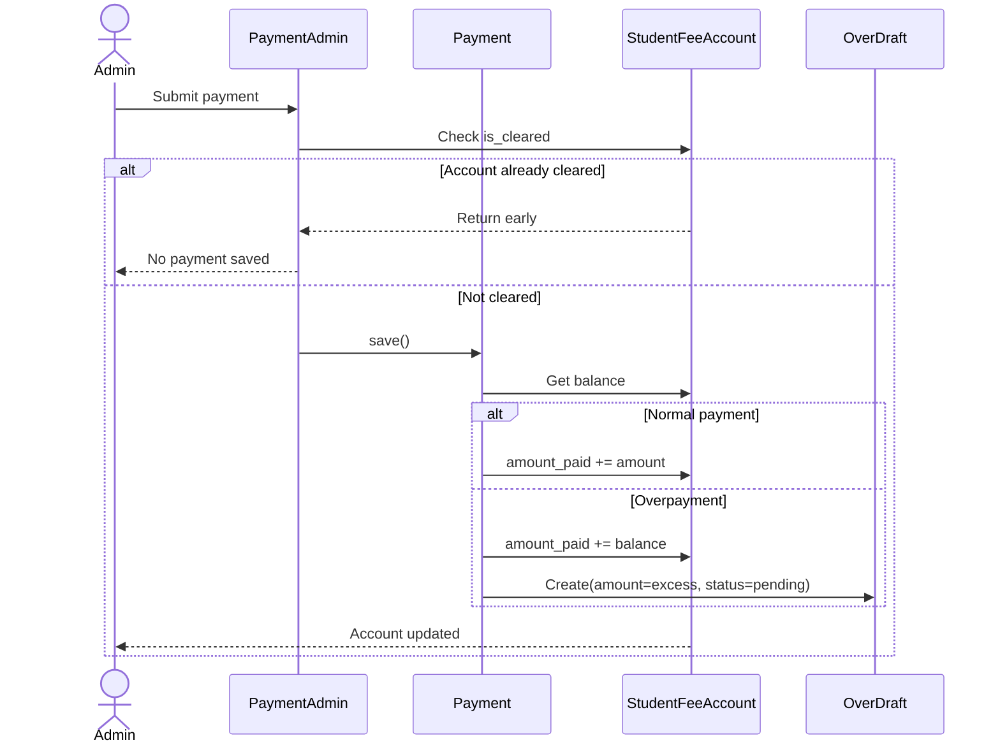
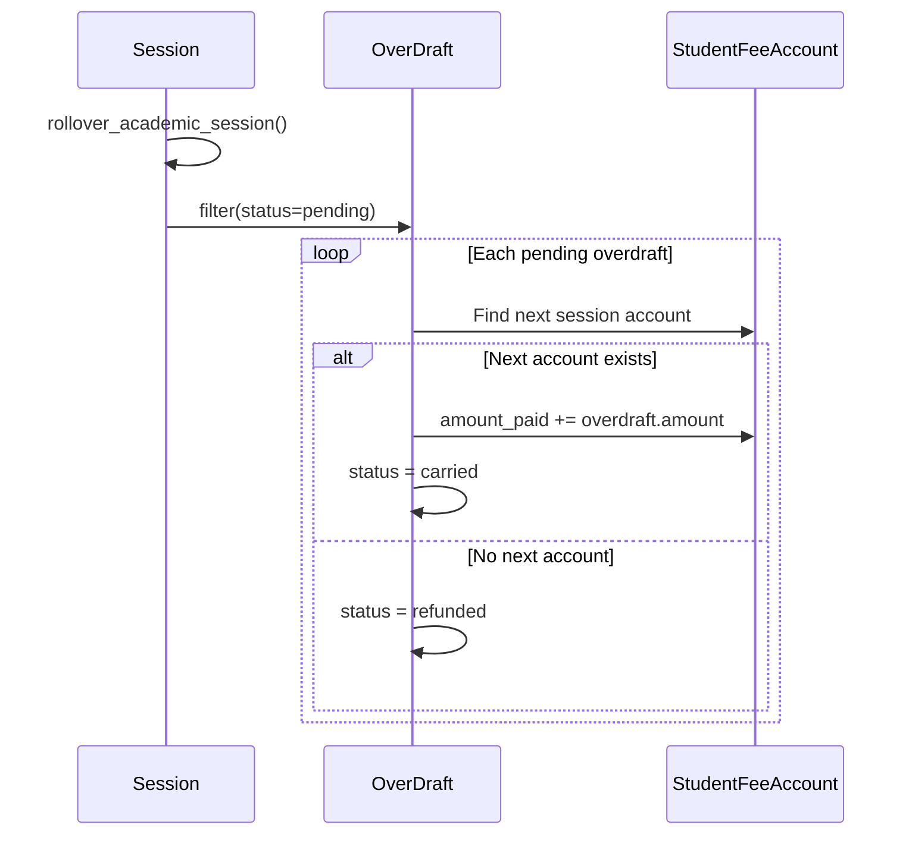

# 🔁 Fees & Payments Sequence Diagram

> How admin, models, and system interact during payment processing.

---

## 💳 Payment Sequence

---

## ⚠️ Overdraft Processing Sequence

---

> 🔗 Back to [Fees Module](index.md)
