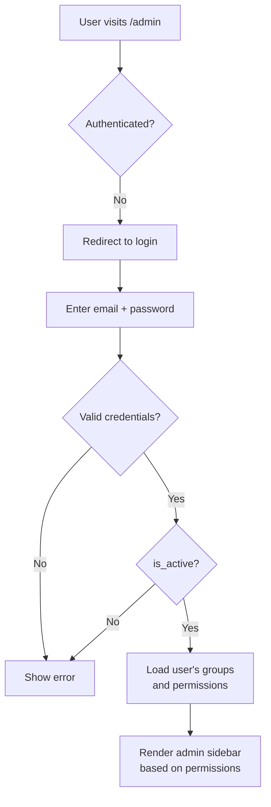

# Login & Access Control

## Authentication Flow

## Role Access Matrix

| Model        | Institution Admin | School Admin | Dept Admin | Lecturer  |
| ------------ | ----------------- | ------------ | ---------- | --------- |
| Student      | Full              | Own school   | Own dept   | View only |
| Lecturer     | Full              | Own school   | Own dept   | —         |
| Curriculum   | Full              | Own school   | Own dept   | View only |
| FeeStructure | Full              | Own school   | —          | —         |
| Payment      | Full              | Own school   | —          | —         |
| Session      | Full              | —            | —          | —         |
