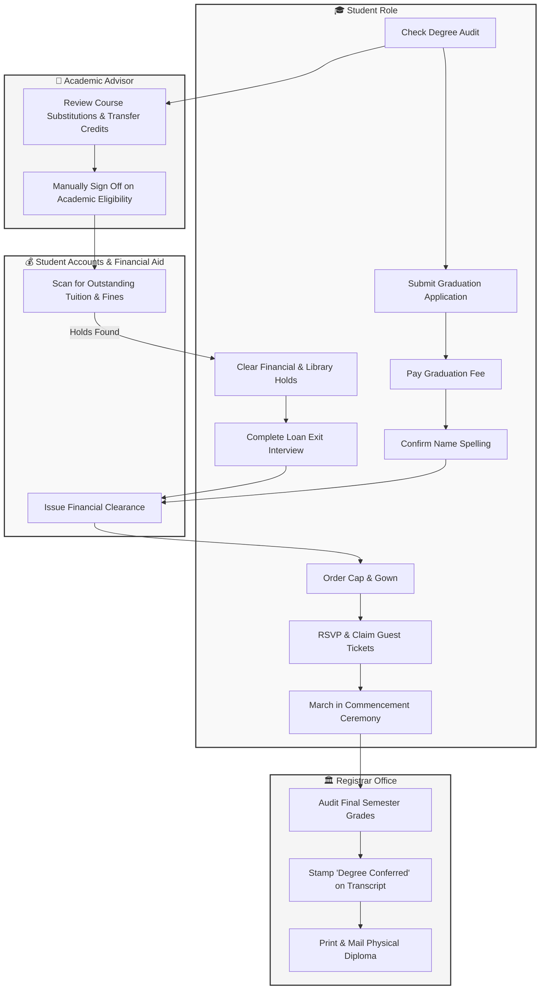
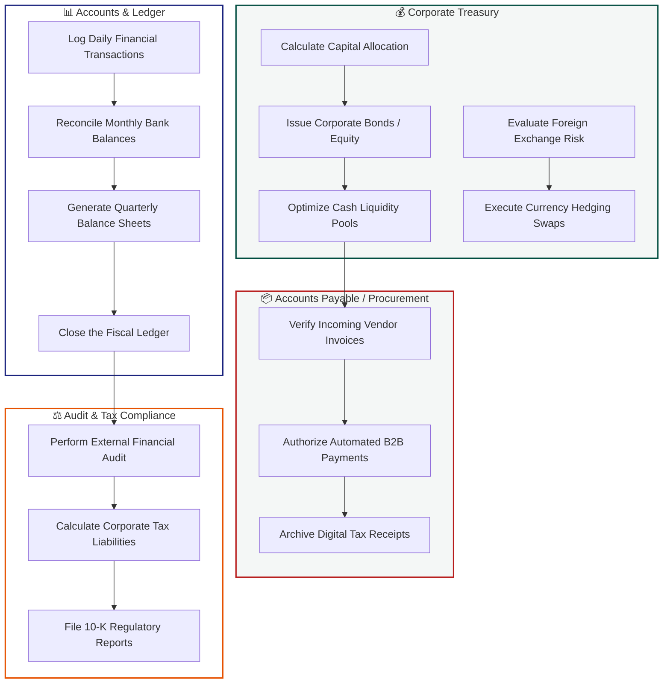

```mermaid
graph TB
    subgraph Student ["🎓 Student Role"]
        A[Check Degree Audit] --> C[Submit Graduation Application]
        C --> D[Pay Graduation Fee]
        D --> E[Confirm Name Spelling]
        H[Clear Financial & Library Holds] --> I[Complete Loan Exit Interview]
        K[Order Cap & Gown] --> L[RSVP & Claim Guest Tickets]
        L --> M[March in Commencement Ceremony]
    end

    subgraph Advisor ["👔 Academic Advisor"]
        A --> B[Review Course Substitutions & Transfer Credits]
        B --> F[Manually Sign Off on Academic Eligibility]
    end

    subgraph Finance ["💰 Student Accounts & Financial Aid"]
        F --> G[Scan for Outstanding Tuition & Fines]
        G -- Holds Found --> H
        I --> J[Issue Financial Clearance]
    end

    subgraph Registrar ["🏛️ Registrar Office"]
        E --> J
        J --> K
        M --> N[Audit Final Semester Grades]
        N --> O[Stamp 'Degree Conferred' on Transcript]
        O --> P[Print & Mail Physical Diploma]
    end

    %% Style definitions to look like swimlanes
    style Student fill:#f9f9f9,stroke:#333,stroke-width:2px;
    style Advisor fill:#f5f5f5,stroke:#333,stroke-width:2px;
    style Finance fill:#f9f9f9,stroke:#333,stroke-width:2px;
    style Registrar fill:#f5f5f5,stroke:#333,stroke-width:2px;
```

## Finance

```mermaid
graph TB
    subgraph Treasury ["💰 Corporate Treasury"]
        A[Calculate Capital Allocation] --> B[Issue Corporate Bonds / Equity]
        B --> G[Optimize Cash Liquidity Pools]
        K[Evaluate Foreign Exchange Risk] --> L[Execute Currency Hedging Swaps]
    end

    subgraph Accounting ["📊 Accounts & Ledger"]
        C[Log Daily Financial Transactions] --> D[Reconcile Monthly Bank Balances]
        D --> E[Generate Quarterly Balance Sheets]
        E --> F[Close the Fiscal Ledger]
    end

    subgraph Procurement ["📦 Accounts Payable / Procurement"]
        G --> H[Verify Incoming Vendor Invoices]
        H --> I[Authorize Automated B2B Payments]
        I --> J[Archive Digital Tax Receipts]
    end

    subgraph Compliance ["⚖️ Audit & Tax Compliance"]
        F --> M[Perform External Financial Audit]
        M --> N[Calculate Corporate Tax Liabilities]
        N --> O[File 10-K Regulatory Reports]
    end

    %% Swimlane visual grouping styles
    style Treasury fill:#f4f7f6,stroke:#004d40,stroke-width:2px;
    style Accounting fill:#fff,stroke:#1a237e,stroke-width:2px;
    style Procurement fill:#f4f7f6,stroke:#b71c1c,stroke-width:2px;
    style Compliance fill:#fff,stroke:#e65100,stroke-width:2px;
```
