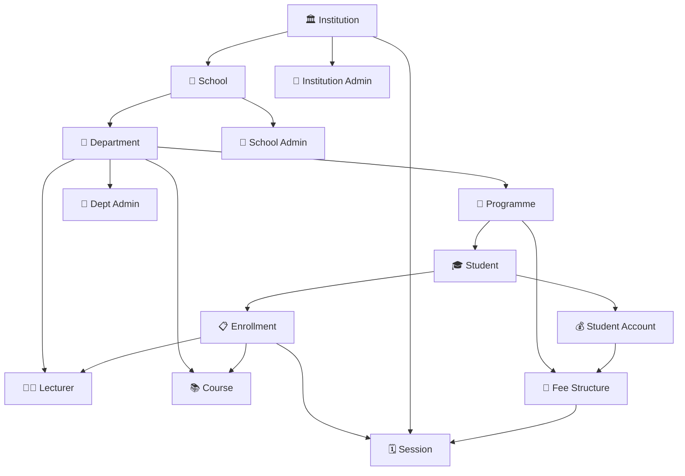

# 🗺️ System Overview

> A high-level sketch of how everything in the system connects —
> who owns what, what flows where, and how the pieces fit together.
> Think of this as the map you read before diving into the details.

---

## 📐 System Diagram



---

## 📖 Reading the Diagram

### 🏛️ The Institutional Hierarchy

The left spine of the diagram shows how the institution is structured:

```
Institution → School → Department → Programme → Student
```

Every student traces back through this chain. A student belongs to a
programme, which belongs to a department, which belongs to a school,
all under one institution. This hierarchy is what makes **scoped access**
possible — a School Admin sees only their school's data, a Dept Admin
only their department's, and so on.

---

### 👥 Admin Roles

Each level of the hierarchy has a corresponding admin role:

```
Institution → 👑 Institution Admin   (sees everything)
School      → 🏫 School Admin        (sees own school)
Department  → 🏢 Dept Admin          (sees own department)
```

These aren't just user types — they map directly to Django permission
groups that are auto-assigned when a user is created.

---

### 🎓 The Student at the Centre

The student is where most of the action happens. From the student,
three major flows branch out:

**📋 Enrollment**
A student enrolls in `Courses`, taught by `Lecturers`, within a `Session`.
Core and Common Unit courses are enrolled automatically on registration.
Electives are registered manually.

**💰 Fee Account**
A student has a `StudentFeeAccount` which is tied to a `FeeStructure`.
The fee structure is defined per programme per session — so what a
student owes is always derived from their programme and the active session,
never hardcoded.

**🗓️ Session**
Almost everything in the system — enrollment, fees, timetabling, reporting —
is anchored to a `Session`. There is only ever **one active session**
institution-wide. This keeps the data model clean and consistent.

---

### 🔄 How Session Ties Everything Together

```
Institution owns Session
Session anchors Enrollment
Session anchors FeeStructure
Session anchors Timetable
Session anchors Reporting
```

When a session rolls over, curriculum is cloned, overdrafts are processed,
and the new session becomes the single source of truth for all new activity.

---

### 🧾 Fee Flow

```
Programme defines FeeStructure per Session
FeeStructure defines what a class owes (breakdown by tuition, hostel, etc.)
Student gets a FeeAccount linked to their FeeStructure
Payments reduce the FeeAccount balance
Overpayments create OverDraft records — carried forward or refunded
```

Fees are never a flat number — they're always computed from the
`FeeStructure.breakdown` JSON field, which means different programmes
can have different fee components without changing the model.

---

## 🔗 Where to Go Next

| Topic                         | Document                                                     |
| ----------------------------- | ------------------------------------------------------------ |
| 🗃️ Full database schema       | [ER Diagram](er-diagram.md)                                  |
| 📋 Every model field by field | [Models Reference](models.md)                                |
| 👥 Who can access what        | [Actors & Access Matrix](actors.md)                          |
| 🎓 Enrollment deep dive       | [Enrollment Module](modules/enrollment/index.md)             |
| 💰 Fee processing deep dive   | [Fees Module](modules/fees/index.md)                         |
| 🔄 Session rollover deep dive | [Session Rollover Module](modules/session-rollover/index.md) |

---

> 🔗 Back to [Documentation Index](README.md)
