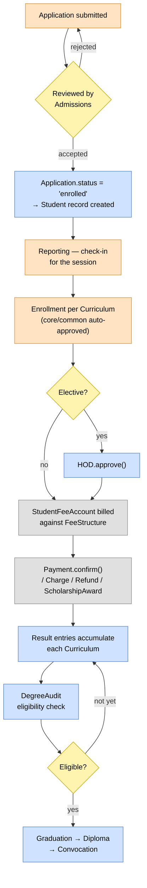
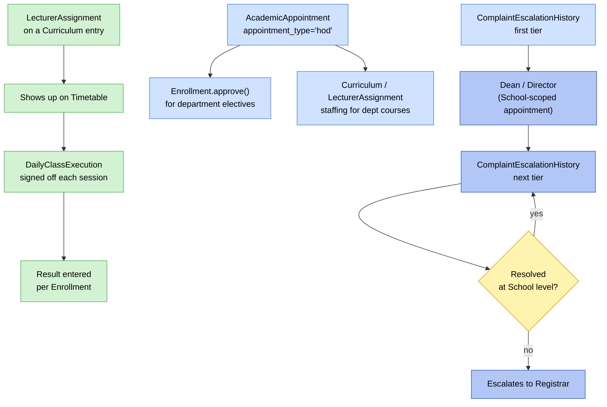
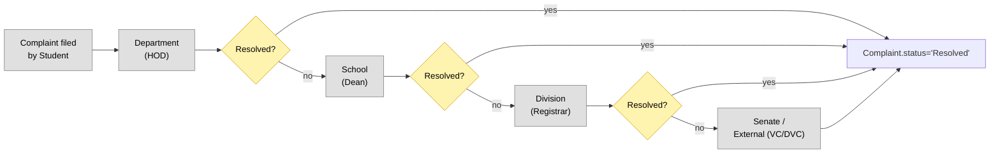
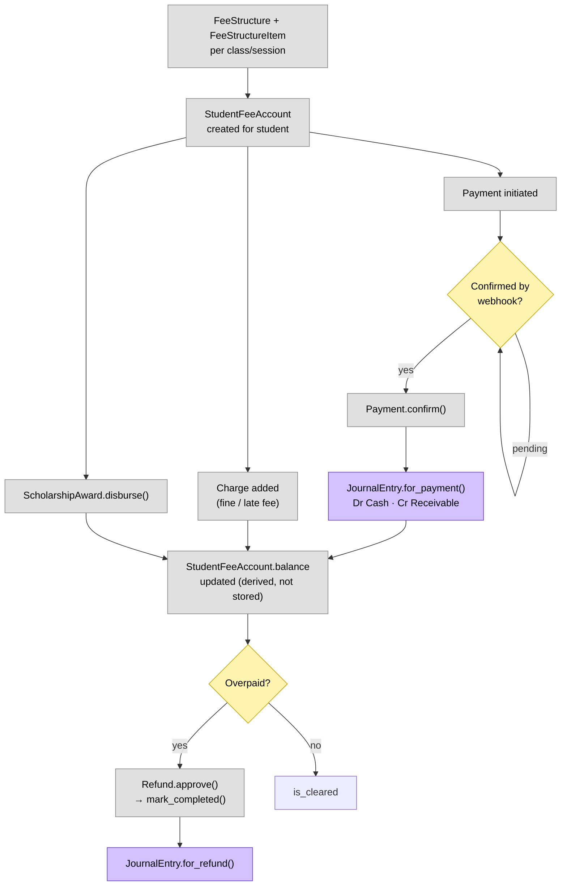
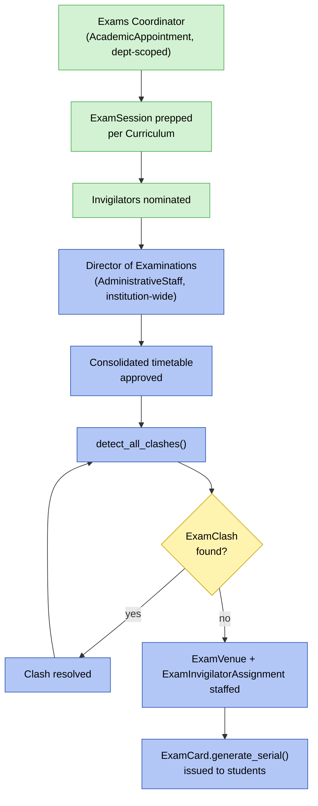
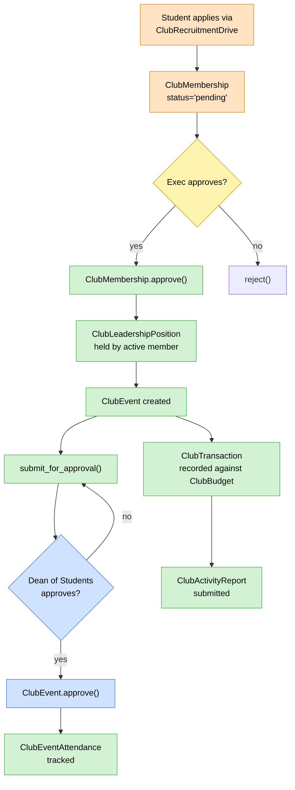
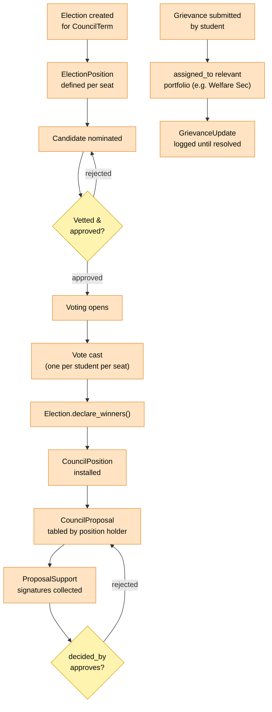
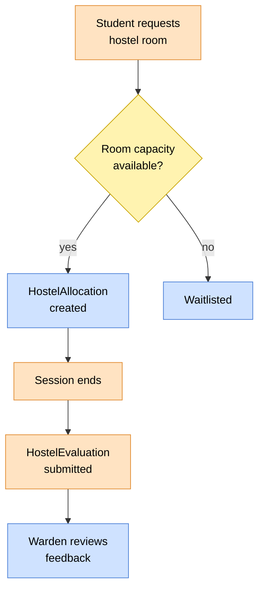

# 🔄 Role-Based Workflows

> How each role actually moves through the system — Mermaid flowcharts,
> one per domain, following the same breakdown as the role walkthrough.
> Diamonds are decision/approval gates; model and method names in node
> labels map directly to what's in the codebase.

---

## 1. Student Lifecycle (cross-role, end to end)

The spine everything else hangs off — admission through graduation, with
the roles that touch each stage.

---

## 2. Academic Staffing & Approval Chain

Lecturer → HOD → Dean/Director — teaching assignment, elective
enrollment, and complaint escalation all share this ladder.

---

## 3. Complaint / Grievance Escalation Chain

The same ladder as above, generalized — this is what
`ComplaintEscalationHistory` actually encodes.

---

## 4. Student Fee Billing & Payment

---

## 9. Exams — Coordinator to Director

---

## 10. Clubs — Membership to Event

---

## 11. Student Council — Election to Governance

---

## 12. Hostel Allocation

---

> 🔗 Back to [Models Reference](models-reference.md)
> 🔗 Back to [ER Diagram](er-diagram.md)
> 🔗 Back to [Project Index](../README.md)
